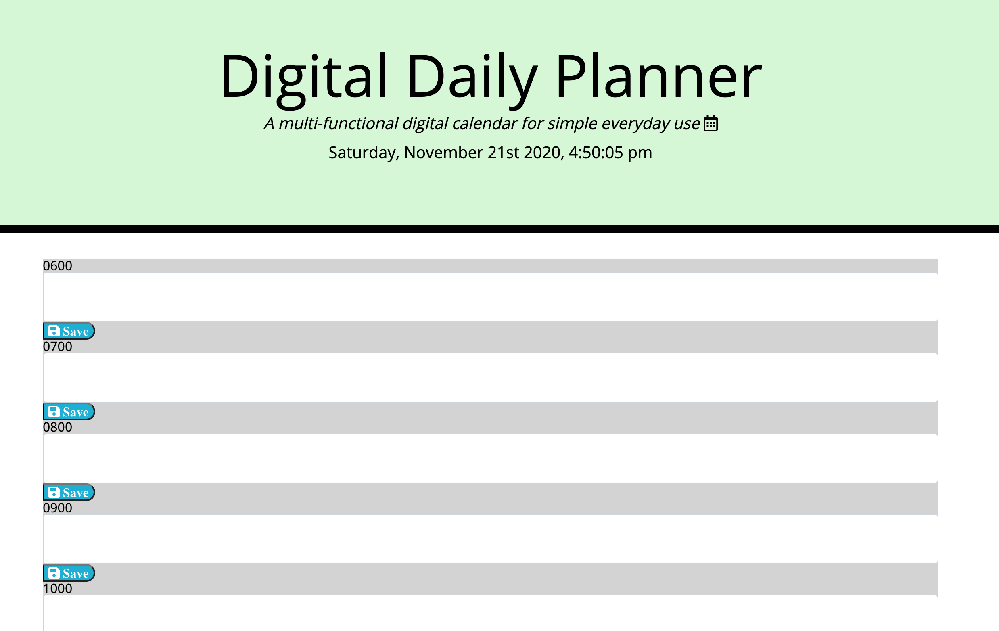

# DigitalDailyPlanner

# Project Description
* To create a fully functioning and accessible online calendar that syncs task in real time. Simple and easy to use.

# Demo Features
* The following image and gif shows the web application's appearance and functionality.
  

# Live URL:
<a href="https://github.com/sjohn214/DigitalDailyPlanner/deployments/activity_log?environment=github-pages">Digital Daily Planner Live</a>

<a href="https://github.com/sjohn214/DigitalDailyPlanner.git">Digital Daily Planner GitHub Repo</a>

# Summary: Project incorporates the following facets
* HTML and CSS and Javascript documents create a day planner.
* The task manager aspect saves entries to local storage
* Emphasizes the use of using Javascript to save and retrieve data from local storage
* Utilizes the use of moment.js for time calculation and formatting conversion

# Highlights:
* Header with local time that updates live
* Input Entries
* Save button that saves items to local storage
* Attribute changes for hour by hour time tracking
* Gray is past the current hour; Red is on the current hour; Green is before the pending hour
* Script features: Moment.js for local time, current time, and time conversion for individual hours
* Appended text to HTML for hour time
* If/else statement to compare time with the current time
* Appended attributes for color current time
* Event listener for the save buttons to save to local storage
* Responsive design using a Bootstrap layout that accommodates for small, medium, large, and large device usage.

# Special Features:
* HTML Pages
  * Index.html
   * Contains inputs for schedule
* CSS Page
  * Styles.css
    * Contains styling (attributes and buttons)
* Javascript Page: Containing 
    * Variables, 
    * Arrays and time conversion 
    * If/else if statements 
    * For Loops 
    * Functions 
    * Local Storage 

# Authors
* Shannondale Page (student) <a href="https://github.com/sjohn214">Git Hub Profile</a>
* Austin Bruch (Bootcamp Instructor)
* Jon Jackson (Bootcamp TA Instructor)
* Daniel Sires (Bootcamp Tutor)